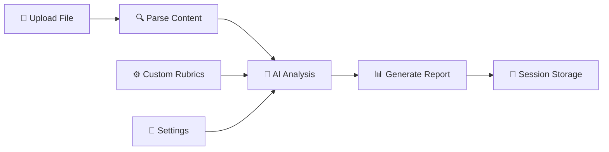
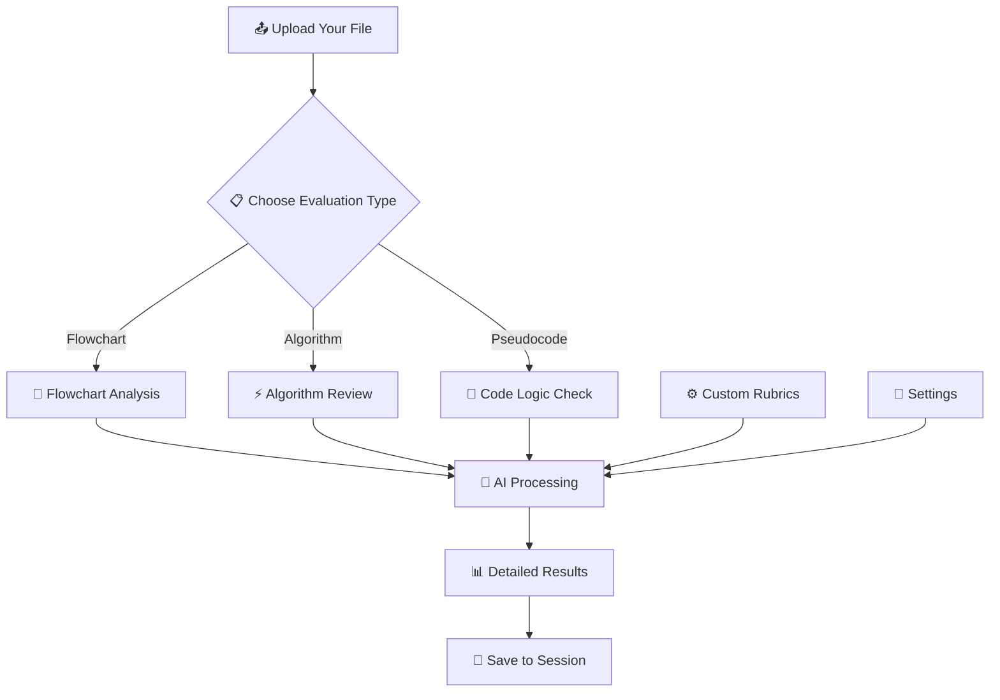

<div align="center">


# RubiAI - Intelligent Rubrics-Based Evaluator

### *Transform your educational assessment with AI-powered precision* ✨

[](https://github.com/Mukul2956/Rubric-AI/stargazers)
[](LICENSE)
[](https://reactjs.org/)
[](https://www.typescriptlang.org/)
[](https://vitejs.dev/)

*An intelligent evaluation system for flowcharts, algorithms, and pseudocode using cutting-edge AI technology*

[🚀 **Live Demo**](https://rubric-ai.vercel.app) • [📖 **Documentation**](#-installation) • [🤝 **Contribute**](#-contributing)

</div>

---

## ✨ **What Makes RubiAI Special?**

<table>
<tr>
<td>

### 🧠 **AI-Powered Intelligence**
- **Claude 3 Haiku Integration** via OpenRouter API
- Smart evaluation against custom rubrics
- Instant feedback with detailed insights
- Multi-format document analysis

</td>
<td>

### 🎨 **Modern & Intuitive**
- Beautiful React 18 + TypeScript interface
- TailwindCSS styling with Radix UI components
- Responsive design for all devices
- Custom branding with professional favicon

</td>
</tr>
<tr>
<td>

### 🔧 **Flexible & Customizable**
- Create, edit, and manage custom rubrics
- Browser-based storage (no servers needed!)
- Session management for temporary data
- Supports PDF, DOCX, PPTX, TXT, PNG, JPG

</td>
<td>

### ⚡ **Fast & Secure**
- Stateless architecture
- Client-side processing
- No data persistence on servers
- Built with Vite for lightning-fast performance

</td>
</tr>
</table>

## 🛠️ **Tech Stack & Architecture**

<div align="center">

| Category | Technology | Purpose |
|----------|------------|---------|
| 🎨 **Frontend** | React 18 + TypeScript | Modern, type-safe UI development |
| ⚡ **Build Tool** | Vite 5.0 | Lightning-fast development & building |
| 🎭 **Styling** | TailwindCSS + Radix UI | Beautiful, accessible components |
| 🤖 **AI Engine** | OpenRouter API (Claude 3 Haiku) | Intelligent document evaluation |
| 💾 **Storage** | Browser localStorage + sessionStorage | Client-side data persistence |
| 📄 **File Processing** | Multi-format parsers | PDF, DOCX, PPTX, TXT, Images |

</div>



## � **Quick Start Guide**

### Prerequisites
- 📦 Node.js 16+ and npm
- 🔑 OpenRouter API Key ([Get yours here](https://openrouter.ai))

### Installation

```bash
# 📥 Clone the magic
git clone https://github.com/Mukul2956/Rubric-AI.git
cd Rubric-AI/frontend

# 📦 Install dependencies
npm install

# 🔧 Configure environment
cp .env.example .env
# Add your OpenRouter API key to .env file

# 🚀 Launch the app
npm run dev
```

<div align="center">

### 🎉 **That's it! Open http://localhost:5173 and start evaluating!**

</div>

### 🔥 **One-Click Deploy**

<div align="center">

[](https://vercel.com/new/clone?repository-url=https://github.com/Mukul2956/Rubric-AI)
[](https://app.netlify.com/start/deploy?repository=https://github.com/Mukul2956/Rubric-AI)

*Don't forget to add your `VITE_OPENROUTER_API_KEY` in the deployment settings!*

</div>

## 🔑 **Getting Your OpenRouter API Key**

<div align="center">

### *Unlock the power of AI evaluation in 5 simple steps!*

</div>

| Step | Action | Description |
|------|--------|-------------|
| **1️⃣** | 🌐 Visit [OpenRouter.ai](https://openrouter.ai/) | The gateway to AI models |
| **2️⃣** | 📝 Create your account | Quick and free signup |
| **3️⃣** | 🔑 Navigate to API Keys | Find it in your dashboard |
| **4️⃣** | ➕ Generate new key | Click "Create API Key" |
| **5️⃣** | 📋 Copy to `.env` file | `VITE_OPENROUTER_API_KEY=your_key_here` |

> 💡 **Pro Tip**: Claude 3 Haiku is free and perfect for educational use!</div>

## 🎯 **How to Use RubiAI**

<div align="center">

### *From upload to insights in seconds!* ⚡

</div>



### 🌟 **Step-by-Step Workflow**

| Step | What You Do | What RubiAI Does |
|------|-------------|------------------|
| **1️⃣ Upload** | 📁 Drag & drop your file | 🔍 Parses content automatically |
| **2️⃣ Configure** | ⚙️ Select rubric type | 🎯 Loads evaluation criteria |
| **3️⃣ Evaluate** | 🚀 Click "Start Evaluation" | 🤖 AI analyzes your work |
| **4️⃣ Review** | 📊 Get detailed feedback | 💡 Actionable improvement tips |
| **5️⃣ Iterate** | 🔄 Refine and re-submit | 📈 Track your progress |

### 📋 **Supported File Formats**

<div align="center">

| Format | Icon | Use Case |
|--------|------|----------|
| **PDF** | 📄 | Research papers, assignments |
| **DOCX** | 📝 | Word documents, essays |
| **PPTX** | 📊 | Presentations, flowcharts |
| **TXT** | 📃 | Plain text, pseudocode |
| **PNG/JPG** | 🖼️ | Images, handwritten diagrams |

</div>

## 📁 **Project Architecture**

<div align="center">

### *Clean, scalable, and well-organized* 🏗️

</div>

```
🎯 RubiAI/
├── 🎨 frontend/
│   ├── 📦 src/
│   │   ├── 🧩 components/          # UI Components
│   │   │   ├── 📊 Dashboard.tsx    # Main overview
│   │   │   ├── 📤 UploadPage.tsx   # File upload interface
│   │   │   ├── 📋 RubricsPage.tsx  # Rubric management
│   │   │   ├── ⚙️ SettingsPage.tsx  # Configuration
│   │   │   └── 🎨 ui/              # Reusable components
│   │   ├── 🔄 contexts/            # State management
│   │   │   ├── 📋 RubricsContext   # Rubric data
│   │   │   └── 💾 SessionContext   # Session data
│   │   ├── 🤖 services/            # AI integration
│   │   │   └── 🧠 AIEvaluationService.ts
│   │   ├── 🔧 utils/               # Helper functions
│   │   └── 🎭 styles/              # Global styling
│   ├── 🌐 public/                  # Static assets
│   │   ├── 🎯 favicon.svg          # Custom logo
│   │   └── 🖼️ favicon-32x32.svg    # Icon variants
│   └── 📦 package.json             # Dependencies
├── 📋 test_files/                  # Sample documents
└── 📖 README.md                    # You are here!
```

### 🎯 **Key Components Overview**

| Component | Purpose | Features |
|-----------|---------|----------|
| 🎨 **UI Layer** | User interface | Modern React + TypeScript |
| 🔄 **State Management** | Data flow | Context API + localStorage |
| 🤖 **AI Service** | Evaluation engine | OpenRouter integration |
| 📋 **Rubric System** | Assessment criteria | Custom, editable rubrics |
| 💾 **Storage Layer** | Data persistence | Browser-based storage |

## 🔒 **Security & Privacy First**

<div align="center">

### *Your data, your control* 🛡️

</div>

| Security Feature | Implementation | Benefit |
|------------------|----------------|---------|
| 🔐 **API Key Protection** | `.env` excluded from Git | Your credentials stay private |
| 🌐 **Client-Side Processing** | No server data storage | Complete privacy control |
| 💾 **Local Storage Only** | Browser-based persistence | No external data leaks |
| 🔄 **Session-Based** | Temporary data handling | Clean slate every session |

> 🛡️ **Privacy Promise**: Your files and evaluations never leave your browser except for AI processing via secure OpenRouter API calls.

---

## 🚀 **Deployment Options**

<div align="center">

### *Choose your deployment adventure!* 🌟

</div>

### 🟢 **Option 1: Vercel (Recommended)**
```bash
# 1. Push to GitHub (already done!)
# 2. Connect to Vercel
# 3. Set environment variable: VITE_OPENROUTER_API_KEY
# 4. Deploy automatically! 🎉
```

### 🟣 **Option 2: Netlify**
```bash
npm run build
# Upload dist/ folder to Netlify
# Add VITE_OPENROUTER_API_KEY in settings
```

### 🟡 **Option 3: GitHub Pages**
```bash
npm run build
# Deploy dist/ folder to GitHub Pages
# Configure environment variables via GitHub Secrets
```

<div align="center">

### 📈 **Performance Metrics**
*Built for speed and efficiency*


</div>

---

## 🌟 **Show Your Support**

<div align="center">

### *If RubiAI helped you, give it a star!* ⭐

[](https://github.com/Mukul2956/Rubric-AI/stargazers)
[](https://github.com/Mukul2956/Rubric-AI/network/members)
[](https://github.com/Mukul2956/Rubric-AI/issues)

</div>

## 🤝 **Contributing**

<div align="center">

### *Join the community of contributors!* 👥

</div>

We welcome contributions! Here's how you can help:

| Type | How to Contribute |
|------|-------------------|
| 🐛 **Bug Reports** | [Create an issue](https://github.com/Mukul2956/Rubric-AI/issues) with details |
| ✨ **Feature Requests** | Share your ideas in [discussions](https://github.com/Mukul2956/Rubric-AI/discussions) |
| 💻 **Code Contributions** | Fork, code, test, and submit a PR |
| 📖 **Documentation** | Improve README, add examples, write guides |
| 🎨 **UI/UX Improvements** | Design better interfaces and experiences |

### 🛠️ **Development Setup**
```bash
git clone https://github.com/Mukul2956/Rubric-AI.git
cd Rubric-AI/frontend
npm install
npm run dev
```

## 📧 **Get Help & Support**

<div align="center">

| Channel | Purpose | Response Time |
|---------|---------|---------------|
| 🐛 **[GitHub Issues](https://github.com/Mukul2956/Rubric-AI/issues)** | Bug reports & feature requests | < 24 hours |
| 💬 **[Discussions](https://github.com/Mukul2956/Rubric-AI/discussions)** | Questions & community chat | Community-driven |
| 📧 **Email** | Private inquiries | mukul@example.com |

</div>

## 📄 **License**

<div align="center">

This project is licensed under the **MIT License** - see the [LICENSE](LICENSE) file for details.

[](https://opensource.org/licenses/MIT)

*Feel free to use, modify, and distribute as you wish!*

</div>

---

<div align="center">

### 🚀 **Made with ❤️ by [Mukul](https://github.com/Mukul2956)**

*Empowering education through intelligent assessment*

[](https://github.com/Mukul2956)

<br><br><br>

**[⭐ Star this project](https://github.com/Mukul2956/Rubric-AI/stargazers) • [🍴 Fork it](https://github.com/Mukul2956/Rubric-AI/fork) • [📢 Share it](https://twitter.com/intent/tweet?text=Check%20out%20RubiAI%20-%20Intelligent%20Rubrics-Based%20Evaluator!%20https://github.com/Mukul2956/Rubric-AI)**

</div>
  